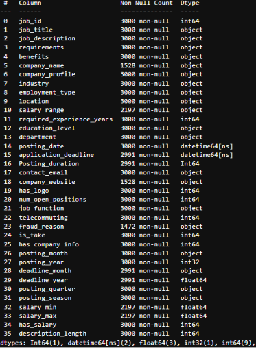
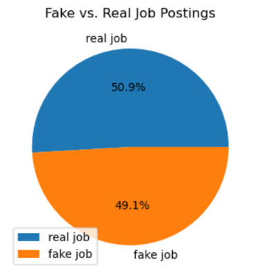

### Fake job posting analysis
## Proejct Overview  
-Employment scams are on the rise. According to CNBC, the number of employment scams doubled. The current market situation has led to high unemployment. Economic stress and the impact of the coronavirus have significantly reduced job availability and the loss of jobs for many individuals. A case like this presents an appropriate opportunity for scammers. Many people are falling prey to these scammers using the desperation that is caused by an unprecedented incident. Most scammer do this to get personal information from the person they are scamming. Personal information can contain address, bank account details, social security number etc. I am a university student, and I have received several such scam emails. The scammers provide users with a very lucrative job opportunity and later ask for money in return. Or they require investment from the job seeker with the promise of a job .This is a dangerious problem that can be analysed through this project 

1. Problem Definition (Project Overview, Project statement)
2. Data Collection
3. Data exploring and preprocessing
4. cleaning
5. Explorotary Data Analysis
6. Presenting Dashboards

## Goal

## Pre Cleaning Findings on Data quantity of the dataset 

1. 100% of fake postings (is_fake=1) are missing both company_name and company_website,while 0% of real postings are missing
2. Average active days for hiring in 365 days in the dataset, minimum active day is 5 day and maximum activevday is ~2.7 years
3. there are 0.49% of company are hiring more then one times .
4. the 26% of the company are not disclosed the salary .
5. Therse is no duplicate job postings
6. contract type of employement is fraud by 48% in the company 
7. Healthcare type of industery is is fraud 50 % in the companys
8. 48% of the company logo is missing which leads to fraud rate of the company

# Analysis
## Data exploration

The data for this project is available at Kaggle - https://www.kaggle.com/datasets/khushikyad001/fake-vs-real-job-postings-synthetic-nlp-dataset . The dataset consists of 3000 observations and 25 features.

Variables such as company name , department and salary_range have a lot of missing values

The dataset is highly unbalanced with 50.933% being real and only 49.066 % of the jobs being fraudulent. A countplot of the same can show the disparity very clearly.

# Exploratory Analysis

## Time-Based Exploratory Data Analysis (EDA)
Time-based EDA was performed to understand how ghost job postings vary over different years and months and to analyze how long job postings remain active before their application deadlines.

## 1. Fake vs. Real Job Postings by Year
This analysis compares the number of legitimate and fake job postings across different years.

Objective:

Identify yearly trends in job postings.
Compare the volume of fake and real job postings over time.
Understand whether the proportion of fake job postings changes across different years.

## 2. Fake Jobs by Month
Monthly analysis was performed to identify seasonal patterns in fake job postings.

Objective:

Determine which months have a higher number of fake job postings.
Identify possible seasonal variations in ghost job activity.
Compare the distribution of fake postings across different months.

## 3 3. Job Posting Duration
Job posting duration was calculated using the difference between the posting date and the application deadline.
Objective 
Understand the typical duration of job postings.
Identify unusually short or long application periods.
Compare posting duration patterns between legitimate and fake job postings.
Determine whether posting duration could be useful as a feature for ghost job detection.

# 1. Company Information EDA

Company-related information was analyzed to identify whether the availability of employer details is associated with fake job postings.
Objective:

Identify missing company information patterns.
Compare company information availability between real and fake job postings.
Determine whether incomplete employer information can act as a potential indicator of a ghost job.

# 2. Salary-Based EDA

Salary information was analyzed to determine whether the availability of salary details differs between legitimate and fake job postings.

Objective:

Determine the availability of salary information.
Compare salary information patterns between real and fake jobs.
Investigate whether missing salary information can be associated with suspicious job postings.

# 3. Job Characteristics EDA

The dataset was analyzed based on different job characteristics to understand how fake job postings are distributed across various categories.

# 4. Fake Job Postings by Location

Location-based analysis was performed to identify geographical patterns in fake job postings.

Objective:

Identify locations with a higher number of fake job postings.
Compare fake job activity across different geographical regions.
Investigate whether remote and location-specific postings show different patterns.

# 5. Fake Job Postings by Employment Type

Employment type was analyzed to determine how fake job postings are distributed among different employment arrangements.

Objective:

Compare the number of fake postings across employment types.
Identify employment categories with relatively high fake-job activity.
Investigate whether certain employment arrangements are more commonly associated with suspicious postings.

# 6. Text-Based EDA — Job Description Length

Text-based analysis was performed to investigate whether the amount of information provided in a job description differs between real and fake job postings.
Objective:

Compare the length of real and fake job descriptions.
Identify whether suspicious postings tend to contain shorter or less detailed descriptions.
Investigate whether description length can be used as a potential feature for ghost job detection.

# SImprovement
The dataset that is used in this project is very unbalanced. Most jobs are real, and few are fraudulent. Due to this, real jobs are being identified quite well. Certain techniques like SMOTE can be used to generate synthetic minority class samples. A balanced dataset should be able to generate better results.

